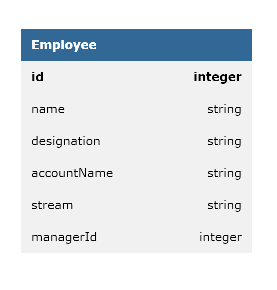
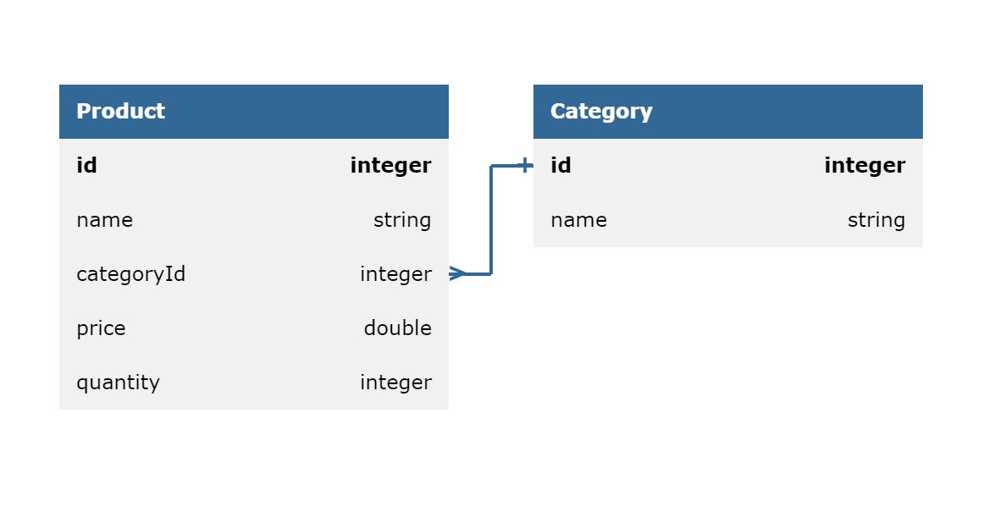

# Employee Management System

## Entitity



## API Methods

1. **GET /api/v1/employees?starts-with={letter}**

    | Query Parameter | Details                                                                                             |
    | --------------- | --------------------------------------------------------------------------------------------------- |
    | starts-with     | required\<character><br>This parameter is used to get the employee details where name starts with letter |
   - response-status : 200
   - response : employee details as JSON

   ```json
    {
        "id": 1,
        "name": "Clark Kent",
        "designation": "Manager",
        "accountName": "smart ops",
        "managerId": 0
    }
   ```

2. **GET /api/v1/streams**

   - response-status : 200
   - response : streams details as JSON

   ```json
    {
        "streams": [
            "stream1",
            "stream2",
            "stream3"
        ]
    }
   ```

3. **PUT /api/v1/employees?employee-id={employee_id}&manager-id={manager_id}&account-name={account_name}&designation={designation_name}**

| Query Parameter | Details                                                                                                                  |
| --------------- | ------------------------------------------------------------------------------------------------------------------------ |
| employee-id     | required\<integer><br>This parameter is used to update he manager-id, account-name and designation of the given employee_id |
| manager-id      | optional\<integer><br>This parameter is used to update he manager-id of the given employee_id                               |
| account-name    | optional\<integer><br>This parameter is used to update he account_name of the given employee_id                          |
| designation     | optional\<integer><br>This parameter is used to update he designation_name of the given employee_id                      |

   - response-status : 200
   - response :

   ```json
    {
        "message": "Clark Kent's Manager has been changed from Diana to Bruce Wayne"
    }
   ```

# Inventory Management System

## Entity



## API Methods

<!-- Create Product -->

1. **POST /api/v1/product**

   - request-body:

   ```json
    {
        "productId": "123",
        "productName": "Name",
        "categoryId": "789",
        "price": 500,
        "quantity": 10
    }

   ```

   - response-status : 200
   - response-body:

   ```json
    {
        "message": "Product is successfully created"
    }
   ```

   <!-- Create Category -->

2. **POST /api/v1/category**

   - request-body:

   ```json
   {
       "categoryId":"789",
       "name":"Name",
   }
   ```

   - response-status : 200
   - response-body:

   ```json
   {
       "message":"Category is successfully created"
   }
   ```

   <!-- List All Products -->

3. **GET /api/v1/product**

   - response-status:200
   - response-body:

   ```json
    {
        "products": [
            {
                "productId": "123",
                "productName": "Name",
                "categoryId": "789",
                "price": 500,
                "quantity": 10
            }
        ]
    }
   ```

   <!-- List products by Category -->

4. **GET /api/v1/product?id={product_id}&category-id={category_id}**

    | Query Parameter | Details                                                                                              |
    | --------------- | ---------------------------------------------------------------------------------------------------- |
    | product-id      | optional\<integer><br>This parameter is used to get the details of the product with the given product_id  |
    | category-id     | optional\<integer><br>This parameter is used to get the details of the product with the given category_id |
   - response-status:200
   - response-body:

   ```json
    {
        "products": [
            {
                "productId": "123",
                "productName": "Name",
                "categoryId": "789",
                "price": 500,
                "quantity": 10
            }
        ]
    }
   ```

5. **GET /api/v1/category?category-id={category_id}**
   
    | Query Parameter | Details                                                                                          |
    | --------------- | ------------------------------------------------------------------------------------------------ |
    | category-id     | required\<integer><br>This parameter is used to get the 

category details with the given category-id |
   - response-status:200
   - response-body:
   ```json
    {
        "categoryId": "123",
        "categoryName": "Name"
    }
   ```

6. **PUT /api/v1/product?product-id={product_id}&name={product_name}&category={category_id}&price={product_price}&quantity={product_quantity}**
   
    *To update details of a product*
    
    | Query Parameter | Detail                                                                                       |
    | --------------- | -------------------------------------------------------------------------------------------- |
    | product-id      | required\<integer> The id of the product to be updated                                       |
    | product-name    | optional\<string> The new name to replace the existing product name                          |
    | category-id     | optional\<integer> The ID of the category to replace the existing category ID of the product |
    | price           | optional\<double> The new price to replace the existing price of the product                 |
    | quantity        | optional\<integer> The new quantity to replace the existing quantity of the product          |
  
   - response-status:200
   - response-body:

   ```json
    {
        "message": "Successfully updated product"
    }
   ```

7. **PUT /api/v1/category?category-id={category_id}&name={category_name}**

    *To update the name of a category*

    | Query Parameters | Details                                                  |
    | ---------------- | -------------------------------------------------------- |
    | category-id      | required\<integer> The id of the category to be updated  |
    | name             | required\<string> The name of the category to be updated |

   - response-status:200
   - response-body:
   
   ```json
    {
        "message": "Successfully updated category"
    }
   ```

8. **DELETE /api/v1/product?product-id={product_id}**

    *To delete a product using its id*

    | Query Parameter | Details                                                |
    | --------------- | ------------------------------------------------------ |
    | product-id      | required\<integer> The id of the product to be deleted |

   - response-status:200
   - response-body:
   ```json
    {
        "message": "Successfully deleted product"
    }
   ```
9.  **DELETE /api/v1/category?category-id={category_id}**
    
    *To delete a category using its id*

    | Query Parameter | Details                                                 |
    | --------------- | ------------------------------------------------------- |
    | category-id     | required\<integer> The id of the category to be deleted |

    - response-status:200
    - response-body:

    ```json
    {
        "message": "Successfully deleted category"
    }
    ```

10. **PUT /api/v1/order?product-id={product_id}&quantity={qty}**

    *To create an Order to buy items*

    | Query Parameter | Details                                                          |
    | --------------- | ---------------------------------------------------------------- |
    | product-id      | required\<integer>  The id of product for which the order is for |
    | quantity        | required\<integer>  The quantity of the product in the order     |

    - response-status: 200

    ```json
    {
        "message": "successfully ordered"
    }
    ```
