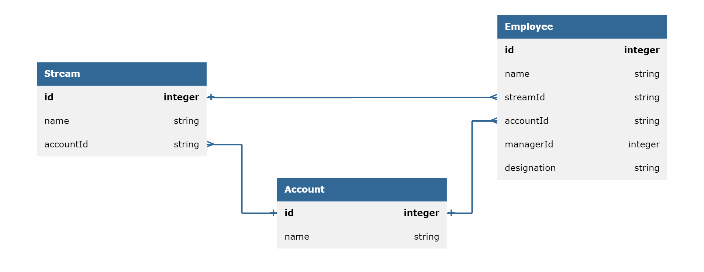
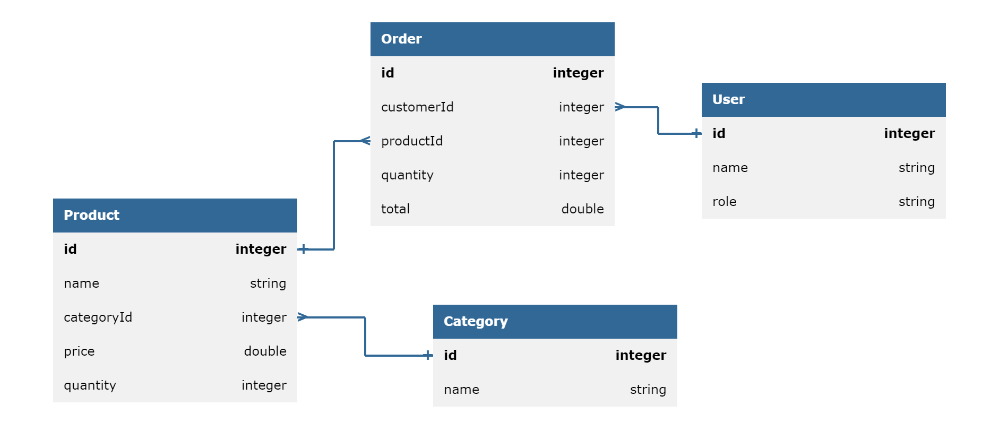

# Employee Management System

## Entitity



## API Methods

1. **GET /api/v1/employees?starts-with={letter}**

   - request-param : starts-with (required : true)
   - response-status : 200
   - response : employee details as JSON

   ```json
   {
       "id" : 1,
       "name"  : "Clark Kent",
       "designation" : "Manager",
       "accountName" : "smart ops",
       "managerId" : ""
   }
   ```

2. **GET /api/v1/streams**

   - request-param-required : false
   - response-status : 200
   - response : streams details as JSON

   ```json
   {
       "streams" : ["stream1","stream2","stream3"]
   }
   ```

3. **PUT /api/v1/employees?employee-id={employee_id}&manager-id={manager_id}&account-name={account_name}&designation={designation_name}**

   - request-param : employee-id (required : true)
   - request-param : manager-id (required : false)
   - request-param : account-name (required : false)
   - request-param : designation (required : false)
   - response-status : 200
   - response :

   ```json
   {
       "message" : "Clark Kent's Manager has been changed from Diana to Bruce Wayne"
   }
   ```

# Inventory Management System

## Entity



## API Methods

<!-- Create Product -->

1. **POST /api/v1/product**

   - request-body:

   ```json
    {
        "productId": "123",
        "productName": "Name",
        "categoryId": "789",
        "price": 500,
        "quantity": 10
    }

   ```

   - response-status : 200
   - response-body:

   ```json
   {
       "message":"Product is successfully created"
   }
   ```

   <!-- Create Category -->

2. **POST /api/v1/category**

   - request-body:

   ```json
   {
       "categoryId":"789",
       "name":"Name",
   }
   ```

   - response-status : 200
   - response-body:

   ```json
   {
       "message":"Category is successfully created"
   }
   ```

   <!-- List All Products -->

3. **GET /api/v1/product**

   - response-status:200
   - response-body:

   ```json
   {
       "products" : [
       {
        "productId":"123",
        "productName":"Name",
        "categoryId":"789",
        "price":500,
        "quantity":10
       }
    ]
   }
   ```

   <!-- List products by Category -->

4. **GET /api/v1/product?id={product_id}&category-id={category_id}**

   - request-body-required : true
   - request-param : category
   - response-status:200
   - response-body:

   ```json
   {
       "products" : [
       {
        "productId":"123",
        "productName":"Name",
        "categoryId":"789",
        "price":500,
        "quantity":10
       }
    ]
   }
   ```

5. **GET /api/v1/category?id={category_id}**
   - request-body-required : true
   - request-param : categoryId
   - response-status:200
   - response-body:
   ```json
   [
       {
       "categoryId":"123",
       "categoryName":"Name",
       }
   ]
   ```
6. **PUT /api/v1/product?product-id={product_id}&name={product_name}&category={category_id}&price={product_price}&quantity={product_quantity}**:
   - response-status:200
   - response-body:
   ```json
   {
       "message":"Successfully updated product"
   }
   ```
7. **PUT /api/v1/category?category-id={category_id}&category-name={category_name}**
   - response-status:200
   - response-body:
   ```json
   {
       "message":"Successfully updated category"
   }
   ```
8. **DELETE /api/v1/product?product-id={product_id}**
   - request-param:productId
   - request-param-required:true
     -response-status:200
   - response-body:
   ```json
   {
       "message":"successfully deleted product"
   }
   ```
9. **DELETE /api/v1/category?category-id={category_id}**

    - request-param:categoryId
    - request-param-required:true
    - response-status:200
    - response-body:

    ```json
    {
        "message": "successfully deleted category"
    }
    ```

10. **PUT /api/v1/order?product-id={product_id}&quantity={qty}**

    - request-param:productId
    - request-param:quantity
    - response-status:200
    - response-body:

    ```json
    {
        "message": "successfully sold"
    }
    ```
